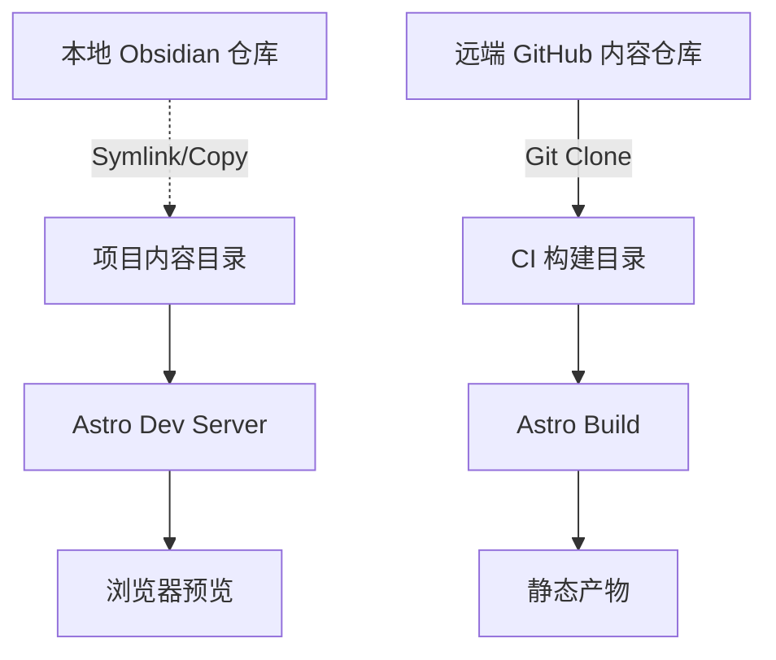

# Astro 静态实验室主页：实现步骤设计（Obsidian 驱动版）

## 目标与核心调整

- **核心驱动**：**Obsidian** 作为 CMS（内容管理系统）。
- **关键调整**：

    1.  **开发模式**：不再强制先 fetch，而是支持指向本地文件夹（软链），实现“Obsidian 编辑 -> 浏览器即时预览”。
    2.  **语法兼容**：必须处理 Obsidian 特有的 WikiLinks (`[[Link]]`) 和相对路径图片/附件。
    3.  **内容主导**：代码仓库定义 Schema（规范），内容仓库（Obsidian）负责对其。如果需要，代码侧提供脚本帮助格式化 YAML。

## 关键架构（本地开发 + CI 双模）

## 内容仓库结构建议（适配 Obsidian）

建议以 **Direct Map** 方式复用你现有的 `Team-Guidebook/` 目录结构（不强制迁移到 `lab/zh/en`）。站点栏目是“视图/聚合”，内容仍按 Obsidian 的目录维护：

- Home：`Team-Guidebook/index.md`（或指定入口文档）
- News：`Team-Guidebook/档案馆/YYYY-MM-DD.md`（Obsidian 日记，按 bullet 抽取；`publish: true` 才公开；`#P/姓名` 关联人）
- People：`Team-Guidebook/通讯录/*.md`
- Projects：`Team-Guidebook/图书馆/项目/*.md`
- Library：`Team-Guidebook/图书馆/**`
- Blog（可选）：`Team-Guidebook/公告板/博客/*.md`
- Attachments：保留 `Team-Guidebook/assets/` 与 `Team-Guidebook/图片库/`，构建时同步到站点 `public/attachments/`，统一通过 `/attachments/...` 访问

## 详细实现步骤更新

### 1) 初始化 Astro 站点骨架

- 初始化 Astro 5 + TS + Tailwind。
- 安装必要的 Markdown 插件库（`remark-wiki-link` 等）。

### 2) 设计路由与 i18n

- 保持 `/zh/...` 和 `/en/...` 的 locale 前缀路由。
- 阶段 1：内容以中文为主（/en 先做 UI 壳 + 空态占位），后续再补英文内容与中英配对跳转。

### 3) 内容同步策略（开发 vs 生产）

- **本地开发**：在 `astro.config.mjs` 或启动脚本中，允许配置 `CONTENT_DIR` 环境变量。
    - 如果是本地路径：直接加载（Astro Content Collections 支持 `base` 路径配置或简单的软链策略）。
- **CI 构建**：编写 `scripts/setup-content.mjs`，在构建前把远端内容 clone 到项目约定的 `src/content` 或 `.content` 目录。

### 4) Obsidian 语法兼容（新增关键步骤）

- **WikiLinks**：集成 `remark-wiki-link`，配置映射规则：`[[...]] `默认解析到 `/<lang>/library/...`（歧义时要求使用路径形式消歧）。
- **Callouts**：集成 `remark-gh-admonitions` 或类似插件，渲染 Obsidian 的 `> [!INFO]` 语法。
- **图片/资源路径**：
    - Obsidian 可能使用 `Team-Guidebook/assets/`、`Team-Guidebook/图片库/` 等目录，站点统一输出到 `public/attachments/`。
    - 方案：在构建时同步/copy 资源目录，并用 remark/rehype 将 `![[img.png]] `统一转为 ``（冲突需 warning）。

### 5) Content Collections & Schema

- 定义严格的 Schema (`src/content/config.ts`)。
- 字段设计：
    - `publish`: boolean (控制是否上线)
    - `date`: date
    - `tags`: array
    - `aliases`: array (People 用于解析 `#P/<Name>`)
    - `related_people`: reference (News/Projects 等关联 People；News 可由 `#P/` 推导)
    - `bib_key`: string (关联 BibTeX)

### 6) Publications (BibTeX)

- 依然使用 `citation-js`，读取 Obsidian 目录下的 `.bib` 文件。

### 7) Library (Team-Guidebook)

- 重点在于**目录树生成**。由于 Obsidian 是文件夹嵌套结构，需要递归扫描 `Team-Guidebook/图书馆/**` 生成侧边栏导航树，并让 WikiLinks 默认指向 Library。

### 8) 评论、搜索、CI/CD